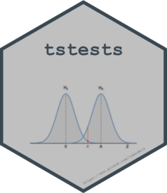

# tstests 

[](https://github.com/tsmodels/tstests/actions)
[](/commits/master)
[](commits/master)
[](https://cran.r-project.org/package=tstests)

# tstests

The `tstests` package provides a number of tests for evaluating the
goodness of fit of estimated time series models as well as forecast
evaluation tests. In addition to a standard print method, each test has
an `as_flextable` method for pretty printing to various document
formats. The table below provides an overview of the implemented tests,
some of which were ported over from **rugarch**, others re-written and
some are new.

| Test | Function | Reference |
|:---|:--:|---:|
| Berkowitz Forecast Density Test | berkowitz_test | Berkowitz (2001) |
| Non Parametric Density Test | hongli_test | Hong and Li (2005) |
| Directional Accuracy Tests | dac_test | Pesaran (1992), Anatolyev (2005) |
| GMM Orthogonality Test | gmm_test | Hansen (1982) |
| Mincer-Zarnowitz Test | minzar_test | Mincer (1969) |
| Sign Bias Test | signbias_test | Engle (1993) |
| Nyblom-Hansen Parameter Constancy Test | nyblom_test | Nyblom (1989) |
| Expected Shortfall Test | shortfall_de_test | Du (2017) |
| Value at Risk Test | var_cp_test | Christoffersen (1998,2004) |

## Installation

The package can be installed from CRAN or the
[tsmodels](https://github.com/tsmodels/) repo.

``` r
install.packages("tstests")
remotes::install_github("tsmodels/tstests", dependencies = TRUE)
```

Note, that in order to make use of symbolic output in some of the tests,
[flextable](https://cran.r-project.org/package=flextable) requires
[equatags](https://cran.r-project.org/package=equatags) to be installed
which has a dependency on
[xlst](https://cran.r-project.org/package=xslt) which in turn has
SystemRequirements libxslt. Therefore, if you are seeing `NA` printed in
place of symbols, then it is likely that xlst is not installed.

## References

Berkowitz,J. (2001). *Testing density forecasts, with applications to
risk management.* Journal of Business & Economic Statistics, 19(4),
465–474.

Hong, Y., and Li, H. (2005), *Nonparametric specification testing for
continuous-time models with applications to term structure of interest
rates*, Review of Financial Studies, 18(1), 37–-84.

Pesaran,M.H., Timmermann,A. (1992). *A simple nonparametric test of
predictive performance.* Journal of Business & Economic Statistics,
10(4), 461–465

Anatolyev,S., Gerko,A. (2005). *A trading approach to testing for
predictability.* Journal of Business & Economic Statistics, 23(4),
455–461.

Hansen,L.P. (1982). *Large sample properties of generalized method of
moments estimators.* Econometrica, 50(4), 1029–1054.

Mincer JA, Zarnowitz V (1969). *The evaluation of economic forecasts.*
In Economic forecasts and expectations: Analysis of forecasting behavior
and performance, 3–46. NBER.

Nyblom,J. (1989). *Testing for the constancy of parameters over time.*
Journal of the American Statistical Association, 84(405), 223–230.

Du Z, Escanciano JC (2017). *Backtesting expected shortfall: accounting
for tail risk.* Management Science, 63(4), 940–958.

Christoffersen PF (1998). *Evaluating interval forecasts.* International
Economic Review, 841–862.

Christoffersen,P., Pelletier,D. (2004). *Backtesting value-at-risk: A
duration-based approach.* Journal of Financial Econometrics, 2(1),
84–108.

Engle RF, Ng VK (1993). *Measuring and testing the impact of news on
volatility.* The Journal of Finance, 48(5), 1749–1778.
